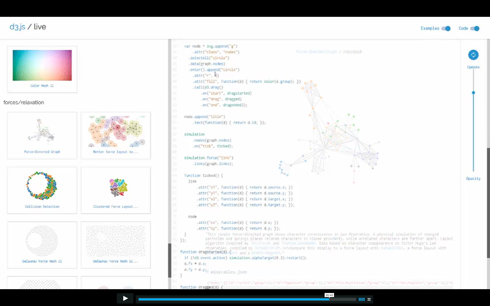

  <h1><a href="https://d3js.org/" target="_blank" style='font-family:"Raleway", sans-serif;'>d3.js</a> / live</h1>
     
    <h2>Getting Started</h2>
    <h3><a href="http://d3js.live" target="_blank">go to d3js.live</a></h3>
    
Activate the "Code" button in the header to view the html file and edit. Select example files from the sidebar to get started with interactive demos.

     
    
     
    <h2>About</h2>
    

        <a href="https://github.com/ekatzenstein/d3.js-live" target="_blank">d3.js / live </a> is an open-source, in progress experiment.
         
          This tool is built using <a href='https://facebook.github.io/react/' target='_blank'>React</a> and <a href='http://redux.js.org/' target='_blank'>Redux</a>. The code block is created with <a href='https://github.com/JedWatson/react-codemirror'
            target='_blank'>react-codemirror</a>, built on top of the awesome
        <a href='http://codemirror.net/' target='_blank'>CodeMirror</a> project. Other dependencies (and big props!) can be found on the <a href="https://github.com/ekatzenstein/d3.js-live/blob/master/package.json" target="_blank">github repo</a>.
    

     
    <h2>Motivation</h2>
    
This is the D3.js version of the code editing tool used with <a href='http://threejs.live' target='_blank'>threejs.live</a>. Just like three.js, I've been working with D3 for a few years and have found that the best educational resource is the set of example files created by <a href="https://github.com/mbostock" target="_blank">Mike Bostock</a> and other members of the community.  This site is built mostly off of Mike Bostock's gists, but there are a good deal of other examples borrowed from <a href="http://bl.ocks.org/" target="_blank">bl.ocks</a>.
   
   
    I made this site for two main reasons. For one, while the robust set of <a href="https://github.com/d3/d3/wiki/Gallery" target="_blank">example files</a> are inspiring, it's difficult to sift through them all. This site looks to curate the examples to a simpler set with the bare necessities. Also, I've found that the best method for learning the elegant/obscure D3 API is through interaction, so this site adds the ability to edit the file in-session.  Users can modify example files without having to clone the repo and run them locally.
      
    There are more substantial tools out there like <a href="http://blockbuilder.org/" target="_blank">Block Builder</a>, so have a look at that if you'd like to create your own blocks. Also, if you'd like to add gists to the site, please submit a PR by editing <a href="https://github.com/ekatzenstein/d3.js-live/blob/master/public/data/gists.json" target="_blank">this file</a>. Thanks!
 
 
    

     
     
     
     
